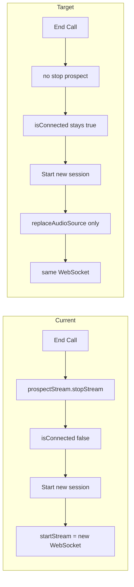

# Keep prospect stream connected across End Call and new session

## Constraints (must follow)

- **Do not touch the manifest.** All changes must operate outside the extension manifest (e.g. `extension/manifest.json` or any manifest file). Do not add, remove, or modify manifest permissions, scripts, or config unless a change is strictly required for this feature; if so, call it out explicitly in the plan.
- **Do not break or refactor existing code.** Make minimal, surgical edits only. Preserve current behavior, structure, and APIs everywhere that is not directly required for this feature. No broad refactors, renames, or restructures; only the specific additions and one-line removals described below.

## Goal

- **End Call** → do not stop the prospect stream; `prospectStream.isConnected` stays **true**.
- **Summary** → prospect remains connected (no `stopStream`, no reconnect).
- **Start new session** → still prompt for a new tab; reuse the **same** WebSocket by swapping only the audio source so we never set the stream to false.

---

## 1. Overlay: Do not stop prospect on End Call

**File:** [components/overlay/sales-coach-overlay.tsx](components/overlay/sales-coach-overlay.tsx)

- In **`handleEndCall`** (around lines 1159–1178): keep all existing cleanup (microphone, speechRecognition, salespersonStream, timers, state) but **remove** the line that calls `await prospectStream.stopStream()`.
- Result: after End Call the prospect WebSocket and pipeline stay up; `prospectStream.isConnected` remains true.

---

## 2. Overlay: Still stop prospect on full reset

**File:** [components/overlay/sales-coach-overlay.tsx](components/overlay/sales-coach-overlay.tsx)

- In **`handleReset`** (around lines 1181–1205): **keep** `prospectStream.stopStream()` so we fully tear down when the user goes back to "ready" / "Start over".
- Prospect is only set to false when the user explicitly resets, not when they End Call and start a new session.

---

## 3. Hook: Add "replace audio source" (keep WebSocket, keep isConnected true)

**File:** [hooks/use-stt-stream-ws.ts](hooks/use-stt-stream-ws.ts)

Add a function that swaps the **input MediaStream** without closing the WebSocket or changing connection state.

- **Name:** `replaceAudioSource(newStream: MediaStream)` (export and add to `UseSTTStreamReturn`).
- **Precondition:** Only run when already streaming and speaker is prospect: `isStreamingRef.current === true` and `speakerRef.current === 'prospect'`; otherwise no-op or return.
- **Steps:**
  1. Validate `newStream` (active, has audio track) similar to [startStream validation](hooks/use-stt-stream-ws.ts) (lines 209–218).
  2. Disconnect current input: disconnect `sourceRef.current` from `scriptProcessorRef.current`; do **not** close WebSocket or set `isConnected` / `isStreaming` to false.
  3. Optionally stop old `streamRef.current` tracks so the previous tab capture can be released.
  4. Create a new `MediaStreamAudioSourceNode` from `audioContextRef.current` and `newStream`, connect it to the existing `scriptProcessorRef.current`, then set `sourceRef.current` and `streamRef.current`.
  5. Do not touch: `wsRef.current`, `sessionIdRef.current`, `setIsConnected`, `setIsStreaming`, or any stop/reconnect logic.
- **Return:** `Promise<void>` (or a boolean "replaced" for the overlay). Add to hook return and type.

---

## 4. Overlay: Start new session — ask for tab, then replace source if already connected

**File:** [components/overlay/sales-coach-overlay.tsx](components/overlay/sales-coach-overlay.tsx)

- In **`setupProspectStream`** (around 947–1008): keep the existing flow so we **always** run `getDisplayMedia` (tab picker) when starting a new session.
- After obtaining a valid `audioStream` (and existing validation that it is live):
  - **If** `prospectStream.isConnected === true` (and ideally `prospectStream.isStreaming === true`): call **`prospectStream.replaceAudioSource(audioStream)`** instead of `prospectStream.startStream('prospect', audioStream)`.
  - **Else:** keep current behavior: `await prospectStream.startStream('prospect', audioStream)`.
- Keep the same error handling and `audioTrack.onended` behavior.
- If `replaceAudioSource` throws or fails: fall back to `prospectStream.stopStream()` then `prospectStream.startStream('prospect', audioStream)` so we do not get stuck.

Result: first session uses `startStream`; after End Call prospect stays connected; Start new session shows tab picker then uses `replaceAudioSource` so the same WebSocket/session is reused and nothing sets the stream to false.

---

## 5. Edge cases

- **Full reset:** Only `handleReset` (and any other "back to ready" path) calls `prospectStream.stopStream()`.
- **Connection-dead recovery / hasBeenConnectedThisSessionRef:** No change needed; recovery only runs in listening/coaching; on summary we are not in that status; when reusing the connection for a new session we remain connected.
- **Server/session:** Same WebSocket and client `sessionId` are kept; if the backend ever needs a "new call" message without closing the socket, that can be a follow-up.

---

## 6. Summary of changes

| Location | Change |
|----------|--------|
| **Manifest** | **No change.** Do not touch. |
| `sales-coach-overlay.tsx` → `handleEndCall` | Remove `prospectStream.stopStream()` (one line). |
| `sales-coach-overlay.tsx` → `handleReset` | Keep `prospectStream.stopStream()` (no change). |
| `use-stt-stream-ws.ts` | Add and export `replaceAudioSource(mediaStream)`; add to return type. No refactor of existing code. |
| `sales-coach-overlay.tsx` → `setupProspectStream` | If `prospectStream.isConnected` (and streaming): call `replaceAudioSource(audioStream)`; else `startStream`. Add try/catch fallback to stop + start on replace failure. Minimal edit only. |

---

## 7. Implementation order

1. Implement **`replaceAudioSource`** in the hook (additive only; no refactor of existing hook logic).
2. Overlay: remove prospect stop from **`handleEndCall`** (one-line removal).
3. Overlay: in **`setupProspectStream`**, add the "if connected → replaceAudioSource, else startStream" branch and failure fallback (minimal change; do not refactor the rest of the function).
4. Leave **`handleReset`** unchanged (still stopping prospect).
5. **Do not modify the manifest** at any step.
6. Test: first session → End Call → summary → Start new session (pick tab) and confirm THEM stays connected and no second-session breakage.
