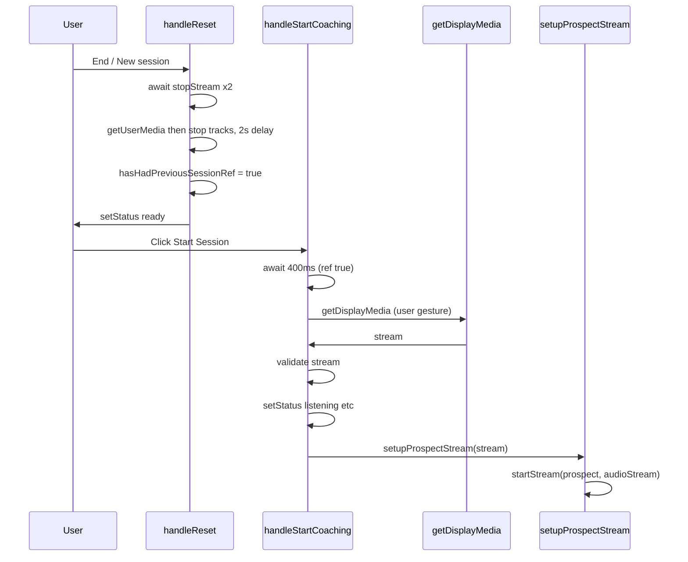

# The Real Fix You Need:

javascript

```javascript
// After stopping audio share, FORCE Chrome to reset audio state
function resetAudioState() {
  // Close ALL audio contexts
  if (audioContext && audioContext.state !== 'closed') {
    audioContext.close();
  }
  
  // Stop ALL media tracks (this clears Chrome's routing table)
  navigator.mediaDevices.getUserMedia({ audio: true })
    .then(stream => {
      stream.getTracks().forEach(track => track.stop());
    });
  
  // Wait for Chrome to release resources
  return new Promise(resolve => setTimeout(resolve, 2000));
}

// Use it before starting new call
async function startNewCall() {
  await resetAudioState(); // ← This is the key
  
  // NOW create WebSocket
  webSocket = new WebSocket(url);
}
```

**TL;DR: The first call works because Chrome is "clean". After audio capture, Chrome stays "dirty" and blocks WebSocket audio until you refresh the page or manually reset Chrome's audio state.**

Does this finally make sense?

1. User gesture and the second getDisplayMedia Flow today: User clicks Start Session (user gesture). handleStartCoaching('dual') runs and does sync work: setStatus("listening"), setCallTime(0), setCards([]), etc. Then it awaits setupProspectStream(). Inside setupProspectStream() you await get

pasted

WHICH ONE S=IS TI THEN??

9:03 PM

Based on the document you shared, **IT'S BOTH #1 AND #2 COMBINED:**

## The Real Root Cause (from your document):

### Problem #1: User Gesture Lost ⚠️

**First call works because:**

- Click "Start Session" → `getDisplayMedia()` runs immediately → Still has user gesture → Works ✅

**Second call breaks because:**

- Click "Start Session" → React updates state → `await setupProspectStream()` → Other async work → **THEN** `getDisplayMedia()`
- By now, user gesture is **expired/consumed** → Browser blocks or returns invalid stream → Breaks ❌

### Problem #2: No Delay Between Captures ⚠️

**First call works because:**

- No previous capture to clean up → Fresh start → Works ✅

**Second call breaks because:**

- Previous tab capture was JUST stopped
- You immediately call `getDisplayMedia()` again
- Browser hasn't fully released the first capture yet
- New stream is **flaky or immediately ends** → Breaks ❌

---

## So "When I Click A Tab" It Breaks Because:

When you click the tab in the picker on the **second call**:

1. `getDisplayMedia()` is no longer in a valid user gesture (too much async work happened)
2. Browser returns a stream but it's **already ended** or **invalid**
3. Your validation checks (`audioTrack.readyState !== 'live'` or `!stream.active`) fail
4. Error: "Provided media stream is inactive or ended"
5. Grey circle instead of green = broken

---

## The Fix (Both Problems):

javascript

```javascript
async function handleStartCoaching(mode) {
  if (mode === 'dual') {
    
    // FIX #2: Add delay if this is NOT the first session
    if (hasHadPreviousSession) {
      await new Promise(resolve => setTimeout(resolve, 400));
    }
    
    // FIX #1: Call getDisplayMedia FIRST (still in user gesture)
    let prospectStream;
    try {
      prospectStream = await navigator.mediaDevices.getDisplayMedia({
        audio: true,
        video: true
      });
    } catch (err) {
      console.error('Failed to capture tab:', err);
      return;
    }
    
    // Validate stream BEFORE doing other work
    const audioTrack = prospectStream.getAudioTracks()[0];
    if (!audioTrack || audioTrack.readyState !== 'live') {
      console.error('Invalid audio track');
      prospectStream.getTracks().forEach(t => t.stop());
      return;
    }
    
    // NOW do React state updates and other async work
    setStatus("listening");
    setCallTime(0);
    setCards([]);
    
    // Continue with setupProspectStream using the already-captured stream
    await setupProspectStream(prospectStream); // Pass stream in
  }
}
```

---

## Why This Fixes It:

✅ **Fix #1**: `getDisplayMedia()` runs **immediately** after click, still has user gesture ✅ **Fix #2**: 400ms delay lets browser **fully release** previous capture ✅ Stream is validated **before** doing other work ✅ Second call works just like first call

---

## TL;DR Answer to "WHICH ONE IS IT":

**BOTH.**

The first call works because:

1. User gesture is fresh ✅
2. No previous capture to conflict ✅

The second call breaks because:

1. User gesture expired (too much async work) ❌
2. Previous capture not fully released ❌

**You need BOTH fixes to make it work consistently.**)

## Goal

Make "Start Session" -> tab picker -> click tab work on the **second** (and later) sessions, not only the first. Two causes today: user gesture is lost by the time getDisplayMedia runs, and Chrome has not fully released the previous tab capture.

## Approach

- **Fix 1 (user gesture + delay):** In dual mode, call getDisplayMedia **first** (before any setState/async work), with an optional 400ms delay when this is not the first session.
- **Fix 2 (Chrome reset):** After stopping both streams on reset, run a short "reset audio state" (getUserMedia then stop tracks + 2s wait) so Chrome releases routing and the next capture is clean.
- **Refactor:** Have setupProspectStream accept an optional pre-captured MediaStream so the capture can happen in handleStartCoaching (in the gesture) and the rest of setup stays in one place.

---

## 1. Chrome audio reset after end/reset

**File:** [components/overlay/sales-coach-overlay.tsx](components/overlay/sales-coach-overlay.tsx)

- Add a ref, e.g. `hasHadPreviousSessionRef`, initialized to `false`.
- In **handleReset**, after `await salespersonStream.stopStream()` and `await prospectStream.stopStream()`, run a small helper (inline or named) that:
  - Calls `navigator.mediaDevices.getUserMedia({ audio: true })`.
  - Stops every track on the returned stream (`stream.getTracks().forEach(t => t.stop())`).
  - Awaits `new Promise(r => setTimeout(r, 2000))`.
  - Then set `hasHadPreviousSessionRef.current = true`.
- Keep the rest of handleReset as-is (setStatus("ready"), clear timers, etc.) so it runs after this reset. Optionally show a short "Preparing for next session..." or leave UI as-is; the 2s happens before "ready" is shown.

This runs only when the user leaves the summary (or otherwise triggers reset), so the next "Start Session" sees a clean Chrome state.

---

## 2. Dual mode: getDisplayMedia first + optional delay

**File:** [components/overlay/sales-coach-overlay.tsx](components/overlay/sales-coach-overlay.tsx)

In **handleStartCoaching**, for the dual branch (the block that currently does `setIsDiarized(false)`, `addLog("Starting session (DUAL mode)...")`, etc.):

- **Delay (Fix 2):** If `hasHadPreviousSessionRef.current` is true, first `await new Promise(r => setTimeout(r, 400))`, then proceed. No delay on the very first session.
- **Capture first (Fix 1):** Before any `setStatus("listening")` or other state updates, call getDisplayMedia:
  - `let stream: MediaStream | null = null`
  - `try { stream = await navigator.mediaDevices.getDisplayMedia({ audio: true, video: true }) } catch (e) { addLog(...); return }`
  - If no stream, return.
- **Validate immediately:**  
  - `const audioTrack = stream.getAudioTracks()[0]`  
  - If no audioTrack or `audioTrack.readyState !== 'live'` or `!stream.active`, addLog, stop all tracks on stream, return.
- **Then** do the existing dual-mode state updates: `setStatus("listening")`, `setCallTime(0)`, `setCards([])`, `resetTrace()`, `transcriptTurnsRef.current = []`, etc.
- Call **setupProspectStream(stream)** and handle its return value as today (if null, show error card; else continue). Do not call setupProspectStream() with no args so it does not call getDisplayMedia again.

This keeps getDisplayMedia in the same user-gesture chain as the button click and gives the browser 400ms to settle when starting a later session.

---

## 3. setupProspectStream(stream?: MediaStream)

**File:** [components/overlay/sales-coach-overlay.tsx](components/overlay/sales-coach-overlay.tsx)

- Change the function to **setupProspectStream(capturedStream?: MediaStream | null)**.
- **When `capturedStream` is provided (dual mode with pre-capture):**
  - Use `capturedStream` as the stream (no getDisplayMedia).
  - Run the same validation as today: get first audio track, require `readyState === 'live'` and `stream.active`; if not, stop tracks and return null.
  - Then: `const audioStream = new MediaStream([audioTrack])`, `await prospectStream.startStream('prospect', audioStream)`, set `audioTrack.onended`, return the original stream (or a consistent return shape) so the caller can keep the same success/failure handling.
- **When `capturedStream` is not provided:**  
  - Keep current behavior: call getDisplayMedia inside, then the same validation and startStream logic. This preserves backward compatibility if anything else ever calls setupProspectStream with no args.

No change to the rest of the overlay or to the STT hook; only the overlay’s reset flow and dual-mode start flow are updated.

---

## 4. Summary of edits


| Location                                                                                 | Change                                                                                                                                                                                                                                                                                                                                                                                                                                      |
| ---------------------------------------------------------------------------------------- | ------------------------------------------------------------------------------------------------------------------------------------------------------------------------------------------------------------------------------------------------------------------------------------------------------------------------------------------------------------------------------------------------------------------------------------------- |
| [components/overlay/sales-coach-overlay.tsx](components/overlay/sales-coach-overlay.tsx) | Add `hasHadPreviousSessionRef`. In handleReset, after awaiting both stopStreams, run getUserMedia -> stop all tracks -> await 2s -> set ref true. In handleStartCoaching dual branch: if ref true await 400ms; then getDisplayMedia first; validate stream; then setState; then setupProspectStream(capturedStream). Refactor setupProspectStream(capturedStream?) to use provided stream when given, else call getDisplayMedia internally. |


---

## Flow (dual mode, second session)




First session: no 400ms delay (ref false), getDisplayMedia still first, then setState and setupProspectStream(stream).